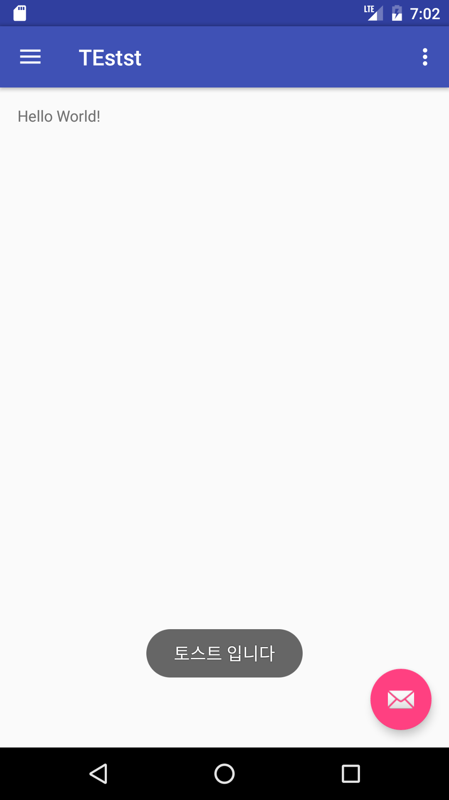
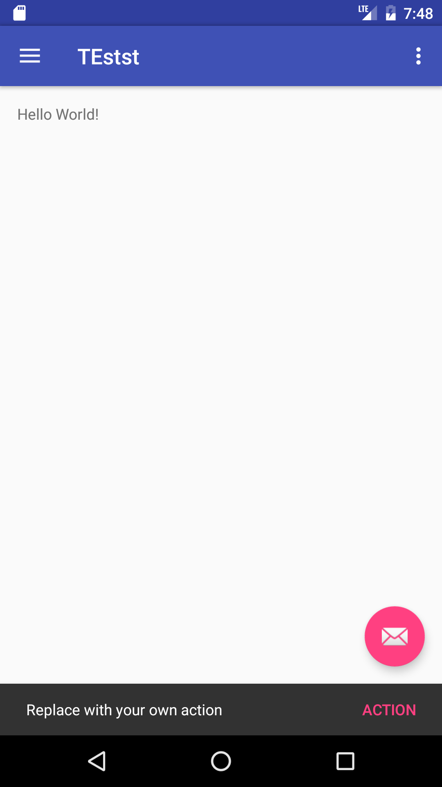
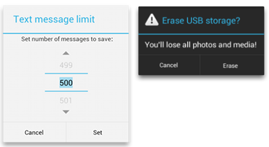
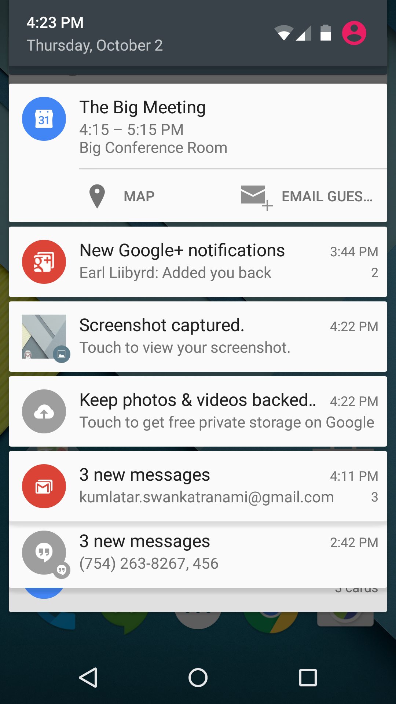
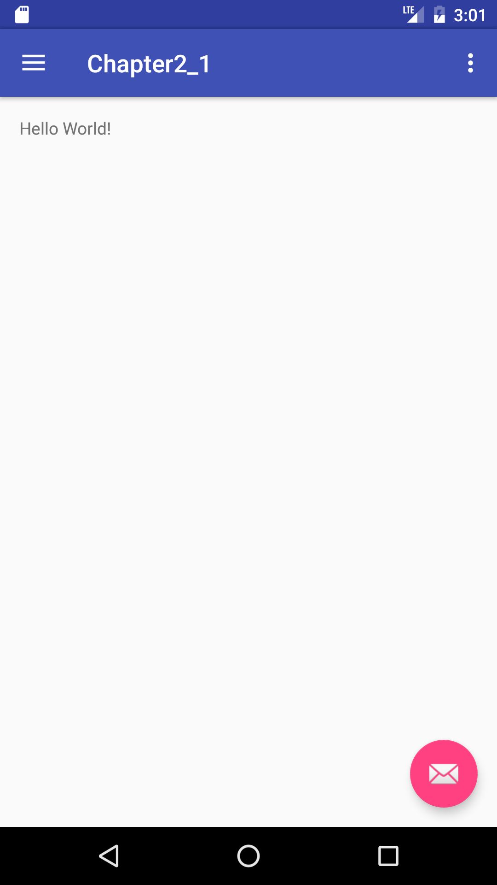
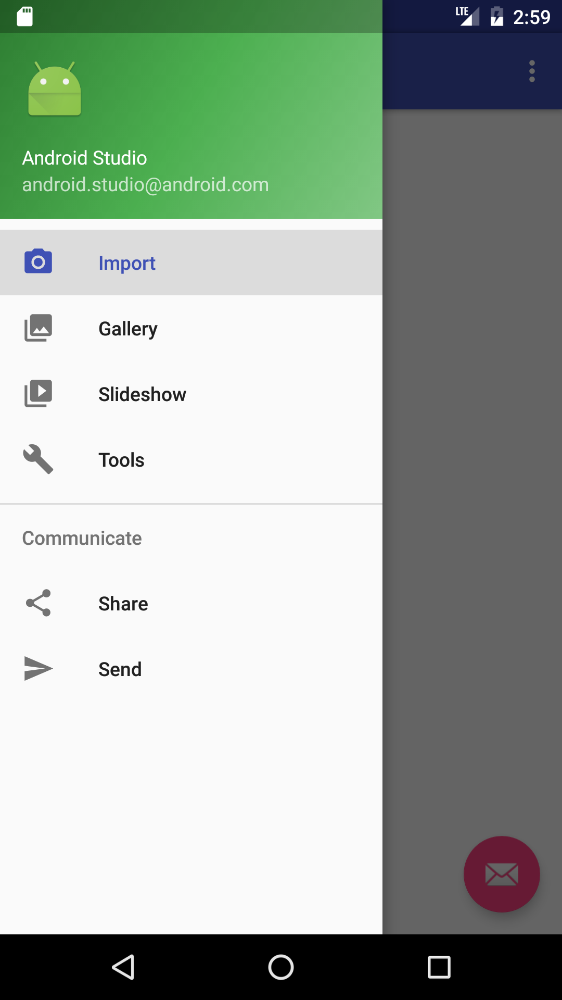
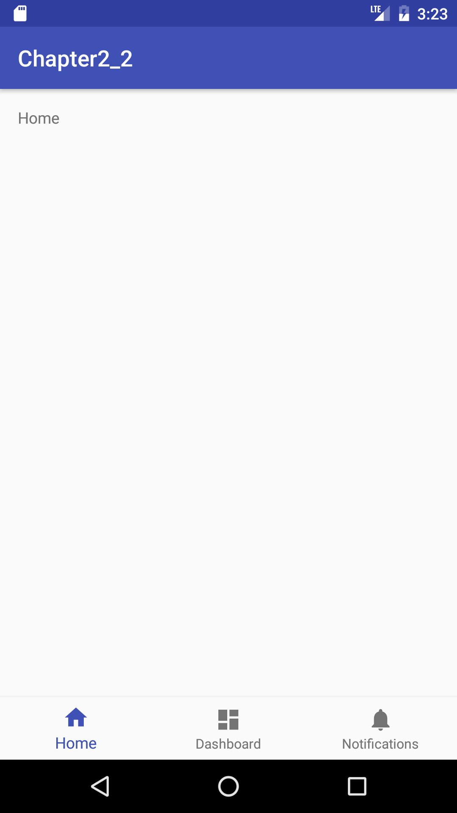
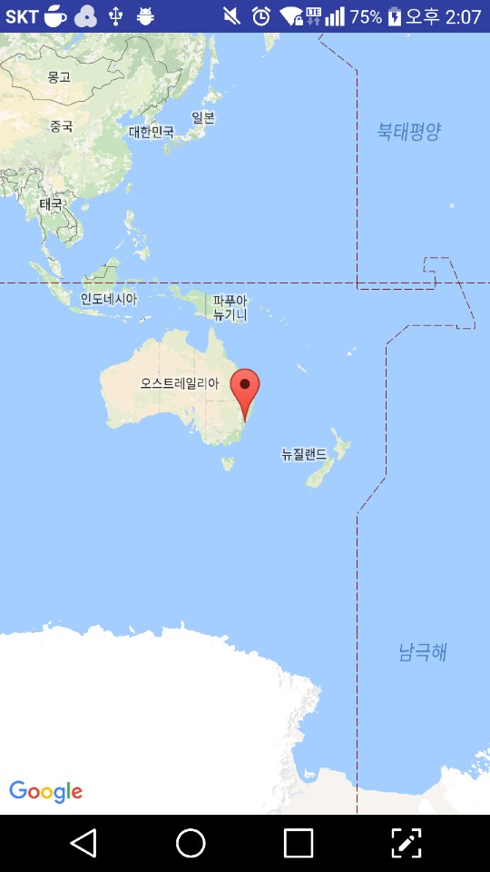

# 안드로이드 2주차 커리큘럼
안드로이드 개발시 필요한 토스트나 스낵바 그리고 인텐트 등을 살펴보고 화면 구성시 자주 사용하는 툴바와 프래그먼트에 대해서 살펴본다. 또한 안드로이드에서 사용할 수 있는 데이터 저장소의 종류를 살펴보고 이를 활용하기 위한 코드를 이해한다.

## 1. 알림 기능 살펴보기
* 토스트 : 적은 양의 메시지를 빠르게 보여주는데 좋은 뷰

  - 이미지 : 

  - 상속계층도

		    java.lang.Object
		      ↳android.widget.Toast

  - 주요 특징 
	 - static Toast makeText(Context context, CharSequence text, int duration)
	  : 텍스트 뷰를 포함한 토스트를 만든다.

	 - show()
	  : 특정 duration동안 토스트를 보여준다.


* 스낵바 : 동작에 따른 짧은 메세지를 보여주기 위한 기능

  - 이미지 : 

  - 상속계층도

        java.lang.Object
        ↳	android.support.design.widget.BaseTransientBottomBar
           <android.support.design.widget.Snackbar>
        ↳	android.support.design.widget.Snackbar

  - 주요 특징
    - static Snackbar make(View view, CharSequence text, int duration)
    : 스낵바를 만드는 메소드.

    - Snackbar setAction(CharSequence text, View.OnClickListener listener)
    : 스낵바에 Action을 설정한다. 리스너는 null가능
      리스너가 null일시 Action은 보이지 않는다.

* 대화상자 : 대화상자는 사용자에게 결정을 내리거나 추가 정보를 입력하라는 작은 창

  - 이미지 : 

  - 상속계층도

          java.lang.Object
           ↳	android.app.Dialog

          Known Direct Subclasses
          AlertDialog,AppCompatDialog,CharacterPickerDialog,Presentation

          Known Indirect Subclasses
          AlertDialog,BottomSheetDialog,DatePickerDialog,MediaRouteChooserDialog,
          MediaRouteControllerDialog,ProgressDialog,TimePickerDialog


  - 대화상자 생성
    - DialogFragment를 상속 받고 onCreateDialog를 오버라이드

  ```{.java id:"chj4zb1ij9"}
      public class FireMissilesDialogFragment extends DialogFragment {
      @Override
      public Dialog onCreateDialog(Bundle savedInstanceState) {
          // Use the Builder class for convenient dialog construction
          AlertDialog.Builder builder = new AlertDialog.Builder(getActivity());
          builder.setMessage(R.string.dialog_fire_missiles)
                 .setPositiveButton(R.string.fire, new DialogInterface.OnClickListener() {
                     public void onClick(DialogInterface dialog, int id) {
                         // FIRE ZE MISSILES!
                     }
                 })
                 .setNegativeButton(R.string.cancel, new DialogInterface.OnClickListener() {
                     public void onClick(DialogInterface dialog, int id) {
                         // User cancelled the dialog
                     }
                 });
          // Create the AlertDialog object and return it
          return builder.create();
      }
  }
  ```

  - 대화상자 종류 :  
  Basic Dialog : 가장 기초적인 방법의 DialogFragment 사용한 대화상자  
  AlterDialog : 경고를 보여주기 위한 대화상자  
  DatePickerDialog 또는 TimePickerDialog : 미리 정의된 UI를 통해 시간이나 날짜를 선택 할 수 있도록 하는 대화상자  


* 통지(Notification) : 애플리케이션의 정상 UI 외부에서 사용자에게 표시할 수 있는 메시지

  - 이미지 : 

  - 상속계층도

          java.lang.Object
           ↳ android.app.Notification

  - 필수 통지 콘텐츠
  Notification 객체는 다음을 반드시 포함해야 합니다.
    - setSmallIcon()이 설정한 작은 아이콘  
    - setContentTitle()이 설정한 제목  
    - setContentText()이 설정한 세부 텍스트  

  - 통지 생성  
   NotificationCompat.Builder 개체에서 알림에 대한 UI 정보와 작업을 지정합니다.  
   알림 자체를 생성하려면 NotificationCompat.Builder.build()를 호출합니다.  
   이는 사양이 포함된 Notification 객체를 반환합니다.  
   알림을 발행하려면 NotificationManager.notify()를 호출해서 시스템에 Notification 객체를 전달합니다  

  - 예제
  ```{.java }
    NotificationCompat.Builder mBuilder =
            new NotificationCompat.Builder(this)
            .setSmallIcon(R.drawable.notification_icon)
            .setContentTitle("My notification")
            .setContentText("Hello World!");
    // Creates an explicit intent for an Activity in your app
    Intent resultIntent = new Intent(this, ResultActivity.class);

    // The stack builder object will contain an artificial back stack for the
    // started Activity.
    // This ensures that navigating backward from the Activity leads out of
    // your application to the Home screen.
    TaskStackBuilder stackBuilder = TaskStackBuilder.create(this);
    // Adds the back stack for the Intent (but not the Intent itself)
    stackBuilder.addParentStack(ResultActivity.class);
    // Adds the Intent that starts the Activity to the top of the stack
    stackBuilder.addNextIntent(resultIntent);
    PendingIntent resultPendingIntent =
            stackBuilder.getPendingIntent(
                0,
                PendingIntent.FLAG_UPDATE_CURRENT
            );
    mBuilder.setContentIntent(resultPendingIntent);
    NotificationManager mNotificationManager =
        (NotificationManager) getSystemService(Context.NOTIFICATION_SERVICE);
    // mId allows you to update the notification later on.
    mNotificationManager.notify(mId, mBuilder.build());

  ```


## 2. 인텐트와 액티비티 실행 살펴보기
* 인텐트의 이해
* 인텐트 활용 예시
* 서로 다른 액티비티 실행 방법

## 3. 툴바와 프래그먼트 그리고 머티리얼디자인 살펴보기
* 툴바의 이해
* 프래그먼트의 이해
* 프래그먼트를 활용한 화면 구성
* CoordinatorLayout, CollapsingToolbarLayout
* 머티리얼 디자인의 이해

## 4. 안드로이드스튜디오 템플릿을 활용한 프로젝트 생성하기
* ## 네비게이션 드로어 프로젝트 생성 및 코드 분석
  - ### 이미지
    - #### 초기화면
    

    - #### 네비게이션 드로워를 펼쳤을때
    

  - ### Java
    - #### MainActivity
    ```java		   
    package com.example.han.chapter2_1;
    import android.os.Bundle;
    import android.support.design.widget.FloatingActionButton;
    import android.support.design.widget.Snackbar;
    import android.view.View;
    import android.support.design.widget.NavigationView;
    import android.support.v4.view.GravityCompat;
    import android.support.v4.widget.DrawerLayout;
    import android.support.v7.app.ActionBarDrawerToggle;
    import android.support.v7.app.AppCompatActivity;
    import android.support.v7.widget.Toolbar;
    import android.view.Menu;
    import android.view.MenuItem;
    
    public class MainActivity extends AppCompatActivity
			implements NavigationView.OnNavigationItemSelectedListener {
			
			@Override
			protected void onCreate(Bundle savedInstanceState) {
			super.onCreate(savedInstanceState);
			setContentView(R.layout.activity_main);
			Toolbar toolbar = (Toolbar) findViewById(R.id.toolbar);
			setSupportActionBar(toolbar);

			FloatingActionButton fab = (FloatingActionButton) findViewById(R.id.fab);
			fab.setOnClickListener(new View.OnClickListener() {
			    @Override
			    public void onClick(View view) {
				Snackbar.make(view, "Replace with your own action", Snackbar.LENGTH_LONG)
					.setAction("Action", null).show();
			    }
			});

			DrawerLayout drawer = (DrawerLayout) findViewById(R.id.drawer_layout);
			ActionBarDrawerToggle toggle = new ActionBarDrawerToggle(
				this, drawer, toolbar, R.string.navigation_drawer_open, R.string.navigation_drawer_close);
			drawer.setDrawerListener(toggle);
			toggle.syncState();

			NavigationView navigationView = (NavigationView) findViewById(R.id.nav_view);
			navigationView.setNavigationItemSelectedListener(this);
		    }

		    @Override
		    public void onBackPressed() {
			DrawerLayout drawer = (DrawerLayout) findViewById(R.id.drawer_layout);
			if (drawer.isDrawerOpen(GravityCompat.START)) {
			    drawer.closeDrawer(GravityCompat.START);
			} else {
			    super.onBackPressed();
			}
		    }

		    @Override
		    public boolean onCreateOptionsMenu(Menu menu) {
			// Inflate the menu; this adds items to the action bar if it is present.
			getMenuInflater().inflate(R.menu.main, menu);
			return true;
		    }

		    @Override
		    public boolean onOptionsItemSelected(MenuItem item) {
			// Handle action bar item clicks here. The action bar will
			// automatically handle clicks on the Home/Up button, so long
			// as you specify a parent activity in AndroidManifest.xml.
			int id = item.getItemId();

			//noinspection SimplifiableIfStatement
			if (id == R.id.action_settings) {
			    return true;
			}

			return super.onOptionsItemSelected(item);
		    }

		    @SuppressWarnings("StatementWithEmptyBody")
		    @Override
		    public boolean onNavigationItemSelected(MenuItem item) {
			// Handle navigation view item clicks here.
			int id = item.getItemId();

			if (id == R.id.nav_camera) {
			    // Handle the camera action
			} else if (id == R.id.nav_gallery) {

			} else if (id == R.id.nav_slideshow) {

			} else if (id == R.id.nav_manage) {

			} else if (id == R.id.nav_share) {

			} else if (id == R.id.nav_send) {

			}

			DrawerLayout drawer = (DrawerLayout) findViewById(R.id.drawer_layout);
			drawer.closeDrawer(GravityCompat.START);
			return true;
		      }
		    }
    ```

    - #### 특이사항 :
     1. Toolbar를 생성해준다. 자바코드에서는 기존의 Actionbar와 같은 절차로 inflate 된다
     2. ActionBarDrawerToggle : Toolbar 와 DrawerLayout을 묶어주는 역할
       API문서에는 onConfigurationChanged 혹은 onOptionsItemSelected 꼭 구현하라고 한다
       onPostCreate에서 syncState를 호출하여 onRestoreInstanceState 발생 이후 동기화를 시켜주도록 한다.

     3. setDrawerListener : deprecated 되었기 때문에 addDrawerListener를 써야한다
  - ## xml
  - ### layout
    - #### activity_main.xml
    ```xml
    <?xml version="1.0" encoding="utf-8"?>
    <android.support.v4.widget.DrawerLayout xmlns:android="http://schemas.android.com/apk/res/android"
        xmlns:app="http://schemas.android.com/apk/res-auto"
        xmlns:tools="http://schemas.android.com/tools"
        android:id="@+id/drawer_layout"
        android:layout_width="match_parent"
        android:layout_height="match_parent"
        android:fitsSystemWindows="true"
        tools:openDrawer="start">

        <include
            layout="@layout/app_bar_main"
            android:layout_width="match_parent"
            android:layout_height="match_parent" />

        <android.support.design.widget.NavigationView
            android:id="@+id/nav_view"
            android:layout_width="wrap_content"
            android:layout_height="match_parent"
            android:layout_gravity="start"
            android:fitsSystemWindows="true"
            app:headerLayout="@layout/nav_header_main"
            app:menu="@menu/activity_main_drawer" />

    </android.support.v4.widget.DrawerLayout>
    ```
    - #### 특이사항
    1. DrawerLayout의 tools:openDrawer="start" : preview 화면에서 drawer가 열려있나 닫혀있나
    2. android:fitsSystemWindows : 뷰가 차지할 수 있는 영역을 상태바 및 소프트키 영역을
    제외한 영역까지 확장
    3. NavigationView 내부에 app:headerLayout, app:menu를 통해 navigation_drawer의
    레이아웃 설정
    
    - #### app_bar_main.xml
    ```xml
    <?xml version="1.0" encoding="utf-8"?>
    <android.support.design.widget.CoordinatorLayout xmlns:android="http://schemas.android.com/apk/res/android"
    xmlns:app="http://schemas.android.com/apk/res-auto"
    xmlns:tools="http://schemas.android.com/tools"
    android:layout_width="match_parent"
    android:layout_height="match_parent"
    android:fitsSystemWindows="true"
    tools:context="com.example.han.chapter2_1.MainActivity">

    <android.support.design.widget.AppBarLayout
        android:layout_width="match_parent"
        android:layout_height="wrap_content"
        android:theme="@style/AppTheme.AppBarOverlay">

        <android.support.v7.widget.Toolbar
            android:id="@+id/toolbar"
            android:layout_width="match_parent"
            android:layout_height="?attr/actionBarSize"
            android:background="?attr/colorPrimary"
            app:popupTheme="@style/AppTheme.PopupOverlay" />

    </android.support.design.widget.AppBarLayout>

    <include layout="@layout/content_main" />

    <android.support.design.widget.FloatingActionButton
        android:id="@+id/fab"
        android:layout_width="wrap_content"
        android:layout_height="wrap_content"
        android:layout_gravity="bottom|end"
        android:layout_margin="@dimen/fab_margin"
        app:srcCompat="@android:drawable/ic_dialog_email" />

    </android.support.design.widget.CoordinatorLayout>
    ```
    - #### 특이사항
    1. AppBarLayout :머터리얼 디자인의 컨셉 중 scrolling gestures를 구현하는
    vertical LinearLayout, 스크롤에 관한 커스터마이징을 위해 쓴다.

    2. android:srcCompat : 플로팅 액션 버튼의 이미지를 설정
    
    - #### content_main
    ```{.xml}
    <?xml version="1.0" encoding="utf-8"?>
    <RelativeLayout xmlns:android="http://schemas.android.com/apk/res/android"
        xmlns:app="http://schemas.android.com/apk/res-auto"
        xmlns:tools="http://schemas.android.com/tools"
        android:id="@+id/content_main"
        android:layout_width="match_parent"
        android:layout_height="match_parent"
        android:paddingBottom="@dimen/activity_vertical_margin"
        android:paddingLeft="@dimen/activity_horizontal_margin"
        android:paddingRight="@dimen/activity_horizontal_margin"
        android:paddingTop="@dimen/activity_vertical_margin"
        app:layout_behavior="@string/appbar_scrolling_view_behavior"
        tools:context="com.example.han.chapter2_1.MainActivity"
        tools:showIn="@layout/app_bar_main">

        <TextView
            android:layout_width="wrap_content"
            android:layout_height="wrap_content"
            android:text="Hello World!" />
    </RelativeLayout>
    ```
    - #### 특이사항
    1. app:layout_behavior="@string/appbar_scrolling_view_behavior"
    이것이 선언 되어있는 곳의 스크롤의 정보에 따라 AppBarLayout이 반응하여 이벤트를
    발생 시킬 수 있도록 한다

  - ### menu
    - #### activity_main_drawer
    ```xml
    <?xml version="1.0" encoding="utf-8"?>
    <menu xmlns:android="http://schemas.android.com/apk/res/android">

    <group android:checkableBehavior="single">
        <item
            android:id="@+id/nav_camera"
            android:icon="@drawable/ic_menu_camera"
            android:title="Import" />
        <item
            android:id="@+id/nav_gallery"
            android:icon="@drawable/ic_menu_gallery"
            android:title="Gallery" />
        <item
            android:id="@+id/nav_slideshow"
            android:icon="@drawable/ic_menu_slideshow"
            android:title="Slideshow" />
        <item
            android:id="@+id/nav_manage"
            android:icon="@drawable/ic_menu_manage"
            android:title="Tools" />
    </group>

    <item android:title="Communicate">
        <menu>
            <item
                android:id="@+id/nav_share"
                android:icon="@drawable/ic_menu_share"
                android:title="Share" />
            <item
                android:id="@+id/nav_send"
                android:icon="@drawable/ic_menu_send"
                android:title="Send" />
        </menu>
    </item>

    </menu>
    ```

    - #### 특이사항
    1. android:checkableBehavior :  전체 그룹에 대한 선택 가능한 동작
    single, all (checkbox), none 3개의 타입이 있다.

    - ### menu.xml
    ```xml
    <?xml version="1.0" encoding="utf-8"?>
    <menu xmlns:android="http://schemas.android.com/apk/res/android"
    xmlns:app="http://schemas.android.com/apk/res-auto">
    <item
        android:id="@+id/action_settings"
        android:orderInCategory="100"
        android:title="@string/action_settings"
        app:showAsAction="never" />
    </menu>
    ```
    - #### 특이사항
    1. app:showAsAction : 항목이 앱 바에서 작업 항목으로 나타나는 시기와 방법을 지정


* ## 하단 네비게이션 프로젝트 생성 및 코드 분석
  - ### 이미지
    - #### 초기화면
    

  - ## Java
  
    - ### MainActivity
    ```java
    package com.example.han.chapter2_2;

    import android.os.Bundle;
    import android.support.annotation.NonNull;
    import android.support.design.widget.BottomNavigationView;
    import android.support.v7.app.AppCompatActivity;
    import android.view.MenuItem;
    import android.widget.TextView;

    public class MainActivity extends AppCompatActivity {

    private TextView mTextMessage;

    private BottomNavigationView.OnNavigationItemSelectedListener mOnNavigationItemSelectedListener
            = new BottomNavigationView.OnNavigationItemSelectedListener() {

        @Override
        public boolean onNavigationItemSelected(@NonNull MenuItem item) {
            switch (item.getItemId()) {
                case R.id.navigation_home:
                    mTextMessage.setText(R.string.title_home);
                    return true;
                case R.id.navigation_dashboard:
                    mTextMessage.setText(R.string.title_dashboard);
                    return true;
                case R.id.navigation_notifications:
                    mTextMessage.setText(R.string.title_notifications);
                    return true;
            }
            return false;
        }

    };

    @Override
    protected void onCreate(Bundle savedInstanceState) {
        super.onCreate(savedInstanceState);
        setContentView(R.layout.activity_main);

        mTextMessage = (TextView) findViewById(R.id.message);
        BottomNavigationView navigation = (BottomNavigationView) findViewById(R.id.navigation);
        navigation.setOnNavigationItemSelectedListener(mOnNavigationItemSelectedListener);
      }

    }
    ```
    - #### 특이사항
     1. BottomNavigationView.OnNavigationItemSelectedListener 사용
    
  - ## xml
  - ### layout
    - #### activity_main.xml
    ```xml
    <?xml version="1.0" encoding="utf-8"?>
    <LinearLayout xmlns:android="http://schemas.android.com/apk/res/android"
    xmlns:app="http://schemas.android.com/apk/res-auto"
    xmlns:tools="http://schemas.android.com/tools"
    android:id="@+id/container"
    android:layout_width="match_parent"
    android:layout_height="match_parent"
    android:orientation="vertical"
    tools:context="com.example.han.chapter2_2.MainActivity">

    <FrameLayout
        android:id="@+id/content"
        android:layout_width="match_parent"
        android:layout_height="0dp"
        android:layout_weight="1">

        <TextView
            android:id="@+id/message"
            android:layout_width="match_parent"
            android:layout_height="wrap_content"
            android:layout_marginBottom="@dimen/activity_vertical_margin"
            android:layout_marginLeft="@dimen/activity_horizontal_margin"
            android:layout_marginRight="@dimen/activity_horizontal_margin"
            android:layout_marginTop="@dimen/activity_vertical_margin"
            android:text="@string/title_home" />

    </FrameLayout>

    <android.support.design.widget.BottomNavigationView
        android:id="@+id/navigation"
        android:layout_width="match_parent"
        android:layout_height="wrap_content"
        android:layout_gravity="bottom"
        android:background="?android:attr/windowBackground"
        app:menu="@menu/navigation" />

    </LinearLayout>
    ```
    - #### 특이사항
     1. app:menu로 레이아웃 지정
     
  - ### menu
    - #### navigation.xml
    ```xml
    <?xml version="1.0" encoding="utf-8"?>
    <menu xmlns:android="http://schemas.android.com/apk/res/android">

    <item
        android:id="@+id/navigation_home"
        android:icon="@drawable/ic_home_black_24dp"
        android:title="@string/title_home" />

    <item
        android:id="@+id/navigation_dashboard"
        android:icon="@drawable/ic_dashboard_black_24dp"
        android:title="@string/title_dashboard" />

    <item
        android:id="@+id/navigation_notifications"
        android:icon="@drawable/ic_notifications_black_24dp"
        android:title="@string/title_notifications" />

    </menu>
    ```

* ## 구글 맵 프로젝트 생성 및 코드 분석

  - ### 이미지
    - #### 초기화면
    
  - ## Java
    - #### MapsActivity.java
    ```java
    package com.example.han.chapter2_3;

    import android.support.v4.app.FragmentActivity;
    import android.os.Bundle;
    import com.google.android.gms.maps.CameraUpdateFactory;
    import com.google.android.gms.maps.GoogleMap;
    import com.google.android.gms.maps.OnMapReadyCallback;
    import com.google.android.gms.maps.SupportMapFragment;
    import com.google.android.gms.maps.model.LatLng;
    import com.google.android.gms.maps.model.MarkerOptions;

    public class MapsActivity extends FragmentActivity implements OnMapReadyCallback {

    private GoogleMap mMap;

    @Override
    protected void onCreate(Bundle savedInstanceState) {
        super.onCreate(savedInstanceState);
        setContentView(R.layout.activity_maps);
        // Obtain the SupportMapFragment and get notified when the map is ready to be used.
        SupportMapFragment mapFragment = (SupportMapFragment) getSupportFragmentManager()
                .findFragmentById(R.id.map);
        mapFragment.getMapAsync(this);
    }


    /**
     * Manipulates the map once available.
     * This callback is triggered when the map is ready to be used.
     * This is where we can add markers or lines, add listeners or move the camera. In this case,
     * we just add a marker near Sydney, Australia.
     * If Google Play services is not installed on the device, the user will be prompted to install
     * it inside the SupportMapFragment. This method will only be triggered once the user has
     * installed Google Play services and returned to the app.
     */
    @Override
    public void onMapReady(GoogleMap googleMap) {
        mMap = googleMap;

        // Add a marker in Sydney and move the camera
        LatLng sydney = new LatLng(-34, 151);
        mMap.addMarker(new MarkerOptions().position(sydney).title("Marker in Sydney"));
        mMap.moveCamera(CameraUpdateFactory.newLatLng(sydney));
      }
    }

    ```
    - #### 특이사항
     1. **OnMapReadyCallback** :  맵이 사용하기 위해 준비를 갖췄을때를 위한 Callback Interface, onMapReady를 구현 해야한다. MapView와 MapFragment 사용시 필수적으로 쓰인다.
     2.  **MapFragment** :  맵을 보여주기 위한 fragment
     3.  **getMapAsync(OnMapReadyCallback onMapReadyCallback)** : 맵 시스템과 뷰를 초기화 한다.
     4.  **addMarker(MarkerOptions options)** :  지도에 마커를 남긴다
     5.  **moveCamera(CameraUpdate update)** : update에 정의된 지시에 따라 위치를 카메라를 옮긴다.
   
   - ## xml
   - ## layout
	  - #### activity_maps.xml
	   ```xml
	  <fragment xmlns:android="http://schemas.android.com/apk/res/android"
     xmlns:map="http://schemas.android.com/apk/res-auto"
     xmlns:tools="http://schemas.android.com/tools"
     android:id="@+id/map"
     android:name="com.google.android.gms.maps.SupportMapFragment"
     android:layout_width="match_parent"
     android:layout_height="match_parent"
     tools:context="com.example.han.chapter2_3.MapsActivity" />
     
     ```
     - #### 특이사항
      1. android:name : 인스턴스화 할 Fragment 클래스를 지정

    - #### AndroidManifest.xml
       ```xml
       <meta-data
            android:name="com.google.android.geo.API_KEY"
            android:value="@string/google_maps_key" />
      ```
       - 매니패스트에 메타데이터로 API키를 추가해야 한다.


## 5. 안드로이드 저장소 살펴보기
* 프리퍼런스(Preference) 활용
* 파일 활용
* 데이터베이스(SQLite) 활용- 토스트
